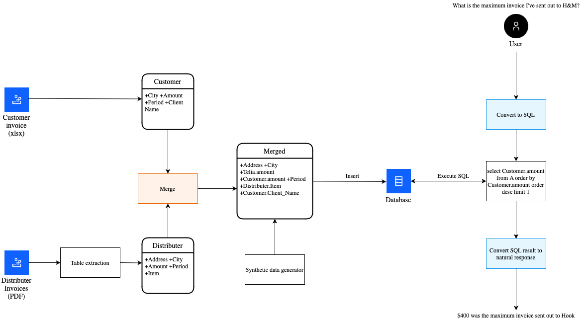
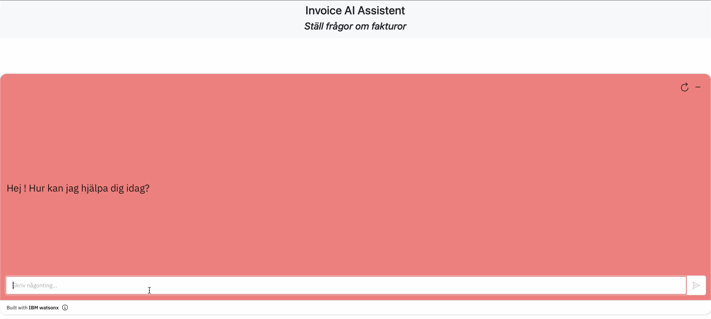

## Business Problem
In the retail sector, invoices are exchanged with various sources, including distributors and customers. Distributors' invoices detail the costs incurred by the business, while customer invoices reflect the sales made. A key challenge is establishing a relationship between these invoices and analyzing them to gain actionable insights. To address this, a solution that leverages a large language model (LLM) to analyze these invoices is needed.

## Solution 
- Create a merged invoice dataset with the invoices received from partners and invoices charged to customers based on common factors (Customer name and location).
- Store the merged invoice dataset to the DB2 database.
- Develop and deploy an LLM based solution on Code Engine to extract data from the database and return a relevant response based on a given user query.
- Create a custom Watson Assistant chatbot interface which accepts user queries and calls the deployed LLM solution to generate a relevant response.
- Develop a custom UI and associate it with the created Watson Assistant chatbot to act as an extension of the assistant.

## Solution Components:
- Watsonx.AI
- IBM DB2
- Watson Assistant
- Code Engine

 

## _[Steps to Replicate Project](setup.md)_
Click [here](setup.md)

 

## Team Composition:

- Partha Pratim Neog (partha.pratim.neog@ibm.com)
- Robert Quinn (robert.quinn@se.ibm.com)
- Victoria Nordin (victoria.nordin@se.ibm.com)
- Aman Sharma (sharma.aman@ibm.com)
- Mula Ram Chamar (mukesh.m2@ibm.com)
- Daniella Zhou (Daniella.Zhou@ibm.com)

### For technical queries or setup assistance, please contact:
- Aman Sharma or Partha Pratim Neog

 

## Architecture

## Main Dashboard
